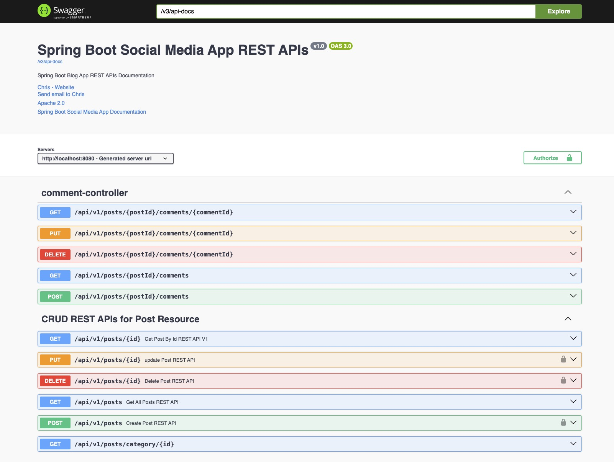
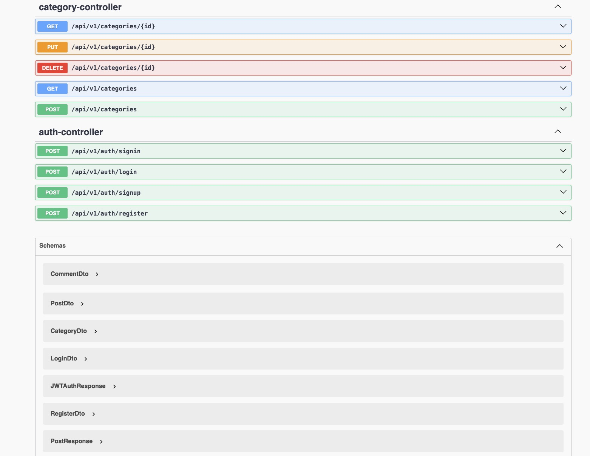

# README: Social Media App REST API Project Using Spring Boot

## Project Overview

This project demonstrates the development of a fully functional REST API for a Social Media application using Spring Boot. It showcases the implementation of advanced features such as security with JWT, Spring Data JPA relationships, and API documentation. This project is an excellent reference for developers looking to understand real-world application of Spring Boot in API development.

## Features

*   REST API Endpoints: Complete CRUD operations for a social media platform.
*   ONE-TO-MANY Relationships: API endpoints for handling complex data relationships.
*   Pagination and Sorting: Efficient data handling and display.
*   Search/Filter Functionality: Enhanced user experience in data retrieval.
*   User Authentication: Secure login and signup using JWT and Spring Security.
*   Exception Handling and Validation: Robust and reliable API performance.
*   Role-Based Security: Implementing varied access levels within the application.
*   JPA/Hibernate Mappings: Effective database relationship management.
*   API Testing: Using Postman.
*   API Documentation: With Swagger UI.
*   Spring Boot Profiles: Environment-specific configurations.
*   Transaction Management: Ensuring data integrity.

## Technologies and Tools

*   Programming Language: Java 8+
*   Frameworks: Spring Boot, Spring MVC, Spring Data JPA (Hibernate), Spring Security
*   Database: MySQL
*   Tools: Swagger for API documentation, Postman for testing, Maven as build tool
*   IDE: IntelliJ IDEA
*   Deployment: AWS Cloud

## Getting Started

To get this project up and running on your local machine for development and testing purposes, follow these steps:

1.  Clone the Repository: `git clone [repository-url]`
2.  Set up Database: Configure MySQL database according to the provided schema.
3.  Configure Application: Set the application properties in `application.yml`.
4.  Run the Application: Use Maven to build and run the project.
5.  Test Endpoints: Use Postman to test the API endpoints.
6.  Explore Swagger Documentation: Visit `[hosted-url]/swagger-ui.html` for API documentation.

## Contributing

Contributions to this project are welcome. Please adhere to the following guidelines:

*   Fork the repository and create your branch from `master`.
*   Write clear and concise commit messages.
*   Ensure any install or build dependencies are removed before the end of the layer when doing a build.
*   Update the README.md with details of changes to the interface, if necessary.

## Acknowledgments

*   Special thanks to everyone who contributed to the development and testing of this project.
*   References to any frameworks, libraries, or any other resources used in this project.